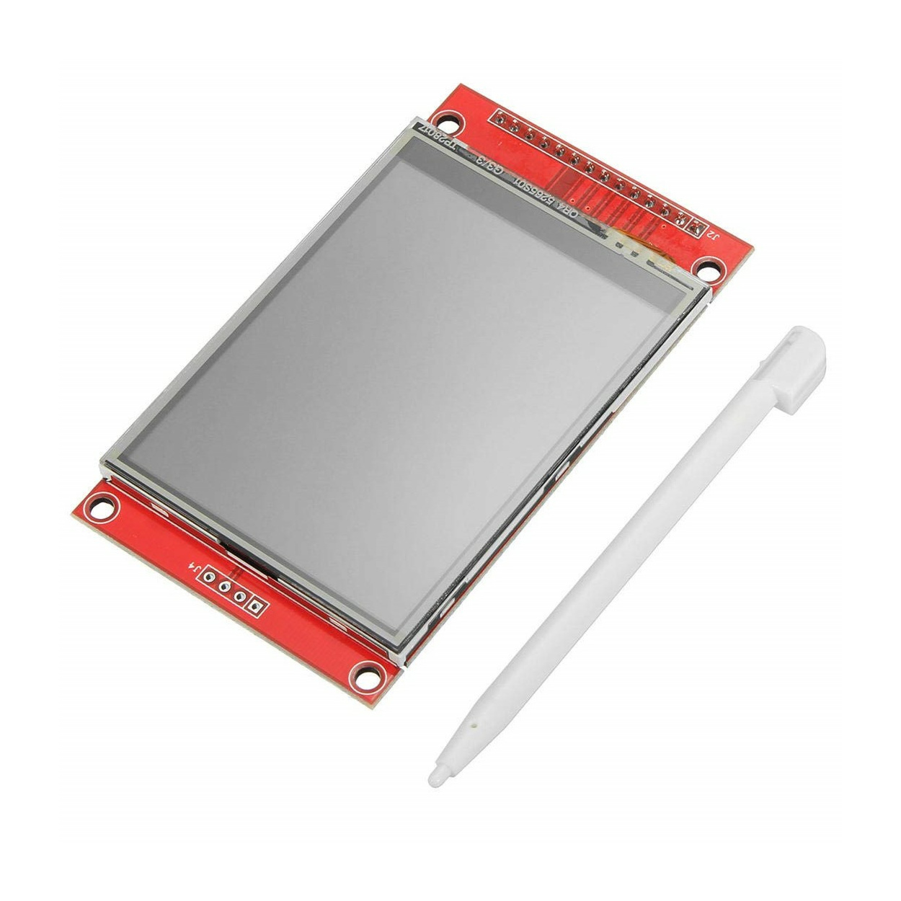

# ESP-IDF LVGL Template for LCD-Based Projects



This template project is designed to help you kickstart your ESP-IDF projects for LCD-based applications using LVGL (Light and Versatile Graphics Library). It includes a simple structure for creating graphics using LVGL, pinouts and LCD connections configurations in the `configs.h` file, and a customizable function `draw_ui` in `gui.c` for your specific graphics code.

## LCD Information

- **Model:** 2.4-inch Touch LCD
- **Driver:** ILI9341
  
## Getting Started

### Prerequisites

Make sure you have the following installed:

- ESP-IDF (Espressif IoT Development Framework)
- CMake
- Python

### Setting Up the Project

1. Clone this repository:

    ```bash
    git clone https://github.com/kevinjacb/ESP_IDF_LCD_TEMPLATE.git
    cd ESP_IDF_LCD_TEMPLATE
    ```

2. Configure the project:

    ```bash
    idf.py menuconfig
    ```

    - Set up your project configuration, including WiFi credentials, if needed.
    - Navigate to `main/configs.h` to set up your LCD pinouts, touch screen configurations, and other relevant settings.

3. Build and flash the project:

    ```bash
    idf.py build
    idf.py -p /dev/ttyUSB0 flash  # Use the appropriate serial port
    ```

4. Monitor the output:

    ```bash
    idf.py -p /dev/ttyUSB0 monitor  # Use the appropriate serial port
    ```

### Customizing the Graphics

Edit the `draw_ui` function in `gui.c` to customize your graphics. This function is responsible for drawing the LVGL GUI elements.

```c
void draw_ui() {
    // Add your LVGL graphics code here
    lv_obj_t *parent = lv_disp_get_scr_act(display);
    // ... (your LVGL graphics initialization code)
}
```

## Folder Structure

- `main/`
  - `CMakeLists.txt`: CMake configuration file for the project.
  - `configs.h`: Configuration file containing pinouts, LCD connections, and touch screen configurations.
  - `gui.h`: Header file (include this wherever necessary)
  - `gui.c`: File containing the `draw_ui` function with LVGL graphics code.
  - `main.c`: Main application file.
- `components/`: External components and libraries.


